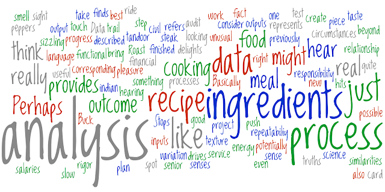

<h1 align="center">CulinaryML</h1>
<h2 align="center">Discover the DELICIOUS possibilities of Machine Learning (ML)</h2>

<h3 align="left">Machine Learning is the act of analyzing large volumes of data using advanced data analytics tools and techniques. Big data, can be structured or unstructured based on their characteristics including the 3Vs:

 - Volume
 - Velocity
 - Variety

Data is all around us — from our social media interactions, emails, traffic data or financial transactions. To make sense of all that data, we use advanced techniques and tools to extract unique insights, draw patterns and predict trends. 

Some of the big data analytics techniques are: 

  * Machine learning is an aspect of artificial intelligence that allows computers to learn and imitate past experiences and human behavior. For it to work, a large volume of data has to be fed into the system to boost its accuracy level to near perfection.
  * Predictive analysis, as the name implies, uses historical data and statistical algorithms to forecast future events.
  * Deep Learning involves searching through large datasets to unearth patterns, make connections and extract insights.
  * Natural Language Processing uses computer programs to understand and interpret human language, whether as text or voice.

In Machine Learning, you don’t only analyze data; you also develop prediction models, create visualizations, and communicate insights to stakeholders.</h3>

<h2 align="left">As technology continues to rapidly evolve, machine learning has emerged as a transformative force across industries. Recognizing the growing demand for expertise in this field, City Colleges of Chicago has taken a proactive approach by joining forces with AWS, a global leader in cloud computing and artificial intelligence.</h2>

<h2 align="left">Through this collaboration, the Machine Learning University at City Colleges of Chicago will offer students a comprehensive and hands-on learning experience, equipping them with the tools to harness the power of machine learning and solve complex real-world problems. This program will empower students to explore new horizons, embrace innovation, and prepare for high-demand careers in a data-driven world.</h2>

  

  

  

- 🔭 I’m currently working on [Learning Machine Learning](https://colleges.ccc.edu/event/machine-learning-through-application/)

- 🌱 I’m currently learning **Python and Jupyter using Numpy and Pandas**

- 👨‍💻 All of my projects are available at [https://github.com/netguru1966/netguru1966/projects?query=is%3Aopen](https://github.com/netguru1966/netguru1966/projects?query=is%3Aopen)

- 📝 I regularly write articles on [https://www.splunk.com/en_us/blog](https://www.splunk.com/en_us/blog)

- 💬 Ask me about **Machine Learning Toolkit (MLKT)**

- 📫 How to reach me **netguru.sec@gmail.com**

- 📄 Know about my experiences [https://www.linkedin.com/in/netguru66/](https://www.linkedin.com/in/netguru66/)

- ⚡ Fun fact **I worked as a Chicago Police Dept before Geeking Out**

<h3 align="right">Connect with me:</h3>

<h3 align="right">Languages and Tools:</h3>

                                 

